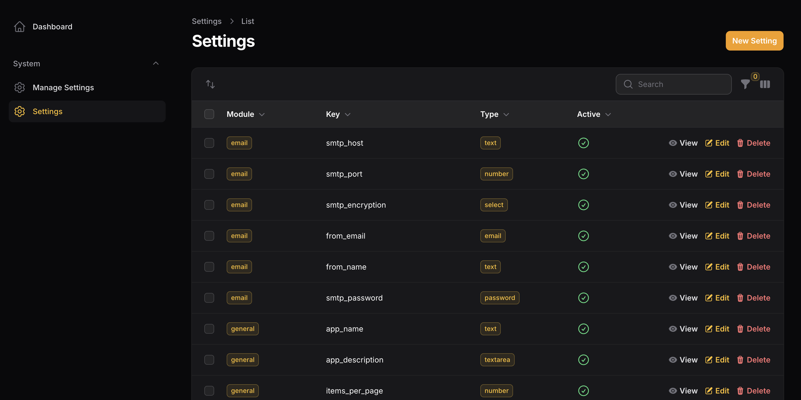
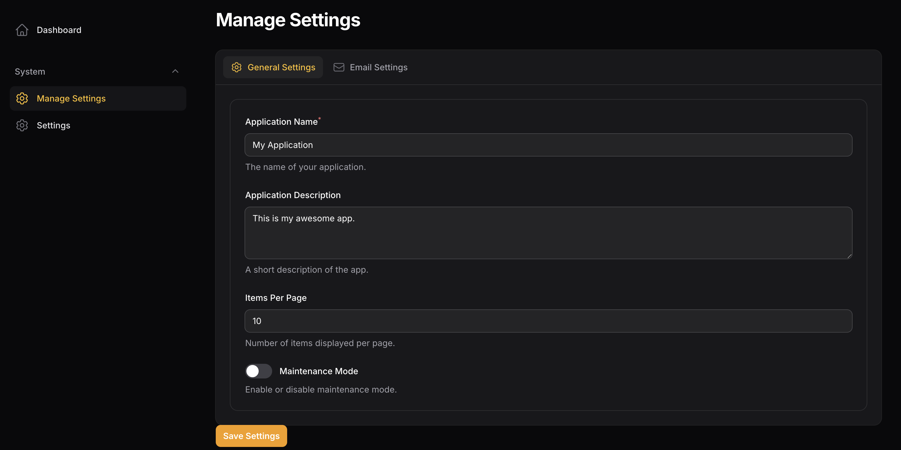

# Filament Dynamic Settings Package

A flexible Laravel package for managing dynamic settings in Filament admin panels with support for both single-tenant and multi-tenant applications.

## Features

- **Flexible Tenancy**: Works with both single-tenant and multi-tenant applications
- **Custom Components**: Extensible system for custom field types
- **Dynamic Field Resolution**: Automatic component resolution based on field types
- **Module Organization**: Organize settings into logical modules
- **Multiple Layouts**: Support for tabs and section layouts
- **Type Safety**: Automatic type casting for different field types

## Installation

```bash
composer require subham/filament-dynamic-settings
php artisan filament-dynamic-settings:install
```

## Setting Resource Image



## Manage Setting Page Image (Tab/Section)


## Configuration

### Single Tenant Setup

```php
// config/filament-dynamic-settings.php
return [
    'multi_tenant' => false,
    // ... other config
];
```

### Multi-Tenant Setup

```php
// config/filament-dynamic-settings.php
return [
    'multi_tenant' => true,
    'tenant_model' => App\Models\Tenant::class,
    'tenant_column' => 'tenant_id',
    // ... other config
];
```

## Usage

### Basic Usage

```php
use Subham\FilamentDynamicSettings\Facades\Settings;

// Get a setting
$value = Setting::get('app_name', 'general', 'Default App Name');

// Set a setting
Setting::set('app_name', 'My Application', 'general');

// In multi-tenant mode (tenant ID is auto-detected)
$value = Setting::get('app_name', 'general', 'Default App Name');

// Explicitly specify tenant
$value = Setting::get('app_name', 'general', 'Default App Name', $tenantId);
```

### Creating Custom Components

#### 1. Register in Config

```php
// config/filament-dynamic-settings.php
'custom_components' => [
    'color_picker' => [
        'component' => YourCustomComponent::class,
        'label' => 'Label for your component',
        'description' => 'Description..',
    ],
],
```

### Advanced Multi-Tenant Usage

#### Custom Tenant Resolution

If you need custom tenant resolution logic, you can extend the Setting model:

```php
namespace App\Models;

use Subham\FilamentDynamicSettings\Models\Setting as BaseSetting;

class Setting extends BaseSetting
{
    protected static function getCurrentTenantId()
    {
        if (auth()->check() && auth()->user()->currentTeam) {
            return auth()->user()->currentTeam->id;
        }
        
        return parent::getCurrentTenantId();
    }
}
```
## License

This package is open-sourced software licensed under the [MIT license](LICENSE.md).

## Changelog

See the changelog for details on changes made in each version.

## Contributing

Contributions are welcome! Please create a pull request or open an issue if you find any bugs or have feature requests.

## Support

If you find this package useful, please consider starring the repository on GitHub to show your support.
